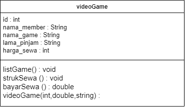

## 2.2.3 Jawaban SOAl
1. 2 karakteristik class/objek adalah memilik sesuatu data/karakter/atribut dan bisa melakukan sesuatu tingkah laku/fungsi/ method
2. kata kunci yang diguanakn untuk mendeklarasikan class adalah variable atribut dan method
3. class "barang" memiliki 4 atribut yaitu, namaBarang, jenisBarang, stok, hargaSatuan. ada pada baris 12 dan 13
4. class "barang" memiliki 4 method, yakni tampilBarang, tambahStok,kurangiStok, hitungHargaTotal. dan ada pada baris 15,21,24,27
5.  modifikasi method kurangiStok()
     
6. method tambahStok() memiliki 1 pramater berupa bilangan int karena menurut saya int n sudah mencangkup semua jumlah stok yang akan ditambah
7. method hitungHargaTotal() memilki tipe data int karena untuk menghitung harga untuk bilangan bulat saja sehingga tidak membutuhkan tanda koma
8. method tambahStok() memiliki tipe data void karena tidak ada kembalian nilai, ehingga nilai yang ditambahkan akan masuk kedalam variabel 

## 2.3.3 Jawaban soal 
1. pada class "BarangMain" proses instansiasi dilakukan pada baris 13 dan nama objek yang dihasilkan adala bl
2. - untuk mengakses atribut pada suatu objek 
    
    - untuk mengakses methid pada suatu objek
    

## 2.4.3 Jawaban soal
1. pada class "barang" deklarasi konstuktor berparameter dilakukan pada baris 17
2. pada class "BarangMain" yang dilakukan adalah melakukan konstruktor berparameter di objek class "barang" dan mengisi nilai parameternya
3. membuat objek dengan nama b3 dengan  konstruktor
    
    hasil output 
    

## latihan praktikum
1. -  ss kode nomor 1 
    

    - ss hasil running nomor 1
    

2. - ss class diagram 

    - ss kode nomor 2

3. - ss kode nomor 3

- ss hasil running nomor 3

4. - ss hasil running nomor 4
